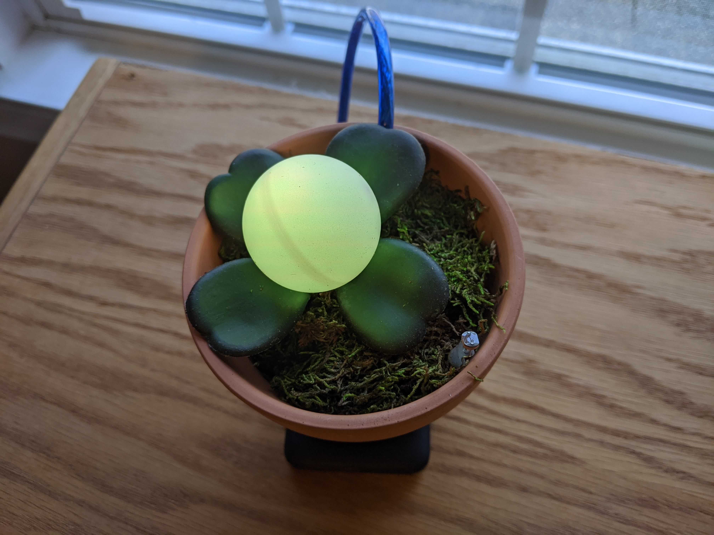

# Arduino Barometer Plant

I wanted a unique bioluminescent plant as a decoration for my desk at work that changed color based on the barometric pressure. This post shows how I built this "plant".

## Materials Used
- Arduino Nano
- BME-280 barometer
- Photoresistor
- 10K resistor
- RGB LED
- Micro USB cable
- 5000 mAh battery pack (optional)
- Snack-sized plastic bag
- Clay pot
- Crafting foam
- Preserved sheet moss
- White ping pong ball
- Plastic leaves
- Hot glue
- Solder or breadboard (either) 

## Libraries Required
- [Adafruit BME280 Library](https://github.com/adafruit/Adafruit_BME280_Library)

## Assembly
1. Using a breadboard or soldering directly to the Arduino, connect all the electronic components according to the diagram below. Note: Ensure that the photoresistor and LED have long enough wires to span the height of the pot.

2. Insert the USB cable into the Arduino and place the Arduino and BME-280 into the plastic bag. Make sure the USB cable, photoresistor and LED are outside of the bag.

3. Place the bag with the Arduino at the bottom of the pot and pack crafting foam on top until it reaches the desired height. 

4. Route the LED, photoresistor and USB cable above the foam and through a round sheet of moss. 

5. Pack the moss into the top of the pot.

6. Using hot glue, seal the exposed metal of the wires on the photoresistor and LED.

7. Drill a small hole into the ping pong ball (about the size of the LED).

8. Glue the LED inside of the ping pong ball.

9. Glue leaves onto the ping pong ball to your liking.

10. Ensure the photoresistor is not covered by moss, and pack everything neatly into the pot.

11. Upload this sketch onto the Arduino after installing the required library.

12. Provide power to the USB cable and you are done. It may take a few days for the plant to adapt to the pressure at your location - disrupting power will reset this.

## Mimicking nature
The plant is designed to adapt to the barometric high and low of the location it is placed. It may take several days for the plant to adapt and become consistent. The plant is given a default pressure range (tuned to my location), but after it experiences a range of pressures (currently 8 hPa) it will use the minimum and maximum pressure it has sensed as the high and low for the location rather than the default. This was designed to mimick the way plants adapt to changes in light levels or seasons. The default values can be changed by updating the `default_min_pressure` and `default_max_pressure` constants in the sketch.

The plant will also only produce light during the day (or when it is light out). While it would be cool for this plant to stay on all the time or only at night (like in the movie Avatar), I am bringing this plant to my workplace and didn't want it lighting up when the lights are out at night. This could be interpreted as mimicking how plants wilt or close up at night. The light behavior can be changed by modifying the line in the sketch containing `light_sensor.IsDark()` to `light_sensor.IsLight()` to make it light up at night only, or to `false` to make it light up all the time. 

